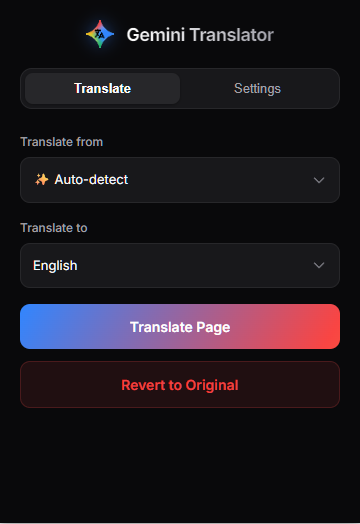

<p align="center">
  
  <!-- Note: You'll need to create a banner image and place it in your repository -->
</p>

<h1 align="center">Gemini Page Translator Pro</h1>

<p align="center">
  <a href="https://github.com/your-username/your-repo/blob/main/LICENSE">
    
  </a>
  <a href="https://developer.chrome.com/docs/extensions/mv3/">
    
  </a>
   <a href="https://chromewebstore.google.com/">
    
  </a>
</p>

<p align="center">
  <strong>A powerful Chrome extension to translate web pages using Google's Gemini AI models, with advanced features and a sleek dark-mode UI.</strong>
</p>

---

<!-- 
  The Table of Contents is crucial for a long README.
  There are tools that can auto-generate this for you.
-->
## Table of Contents

- [About The Project](#-about-the-project)
    - [Key Features](#-key-features)
    - [Screenshots](#-screenshots)
- [ Tech Stack](#️-tech-stack)
- [ Architectural Decisions](#-architectural-decisions)
- [ Getting Started](#-getting-started)
    - [Prerequisites](#prerequisites)
    - [Installation](#installation)
- [ Roadmap](#️-roadmap)
- [ License](#-license)
- [ Contact](#-contact)

---

##  About The Project

**Gemini Page Translator Pro** is a modern Chrome extension built with Manifest V3 that harnesses the power of Google's Gemini family of AI models to provide high-quality, context-aware translation of web pages.

Unlike traditional translation services, this extension leverages advanced generative AI to understand and translate text, preserving nuance and context. It features a user-friendly dark-mode interface for configuring your API key, preferred models, and languages. With support for both full-page and on-demand selection translation, it offers a flexible and powerful tool for anyone browsing the multilingual web.

###  Key Features

*   **High-Quality AI Translation:** Utilises the Google Gemini API (including Gemini 2.5, Gemma 3, and Gemma 2 families) for superior translation quality.
*   **Full Page Translation:** Translate an entire webpage with a single click from the extension popup.
*   **Context Menu Integration:** Simply select text, right-click, and translate it instantly in-place.
*   **Interactive Translations:** Translated text can be clicked to toggle back to the original version, with a helpful tooltip showing the alternative.
*   **Auto-Translation:** Configure a list of websites to be translated automatically every time you visit them.
*   **Efficient & Smart:** Features in-session caching to avoid re-translating text and a robust API queueing system to manage requests gracefully and prevent rate-limiting errors.
*   **Modern & Secure:** Built on Manifest V3, ensuring better performance, privacy, and security.

###  Screenshots

|               Main Interface                |
|:---------------------------------------------------:| 
|  |

---

##  Tech Stack

A list of the major technologies used in the project.

*   [HTML5](https://en.wikipedia.org/wiki/HTML5)
*   [CSS3](https://en.wikipedia.org/wiki/CSS)
*   [Vanilla JavaScript](http://vanilla-js.com/)
*   [Chrome Extension API (Manifest V3)](https://developer.chrome.com/docs/extensions/mv3/)
*   [Google Gemini API](https://ai.google.dev/docs/gemini_api_overview)

---

##  Architectural Decisions

I chose a **Manifest V3 architecture with a Service Worker** for the background logic. This aligns with modern Chrome extension standards, providing improved security and performance by moving processes off the main thread.

For DOM manipulation, the content script uses `document.createTreeWalker`. This is a highly efficient method for traversing the DOM and collecting only `TEXT_NODE` elements, ensuring that scripts, styles, and other non-textual elements are ignored. This prevents page breakage and isolates the translation logic to relevant content.

To manage API interactions, I implemented a **request queue with concurrency limiting**. All translation requests are added to a queue, which is processed in batches. This prevents overwhelming the Gemini API with too many simultaneous requests, gracefully handling rate limits and ensuring stability, especially on text-heavy pages. An in-memory `Map` serves as a session cache to prevent redundant API calls for the same text, saving API costs and speeding up re-translations.

Finally, translations are **non-destructive**. The original text is stored in a `data-original-text` attribute on a `<span>` that wraps the translated content. This makes reverting translations trivial and instantaneous, without requiring a page reload or complex state management.

---

##  Getting Started

To get a local copy up and running, follow these simple steps.

### Prerequisites

*   A Chromium-based web browser (e.g., Google Chrome, Microsoft Edge, Brave).
*   A **Google Gemini API Key**. You can obtain one from [Google AI Studio](https://aistudio.google.com/u/0/api-keys/).

### Installation

1.  Clone the repository or download it as a ZIP file and unzip it.
    ```bash
    git clone https://github.com/medy17/GeminiTranslate.git
    ```
2.  Open your Chromium-based browser and navigate to the extensions page. For Chrome, this is `chrome://extensions`.
3.  Enable **"Developer mode"** using the toggle switch, usually found in the top-right corner.
4.  Click the **"Load unpacked"** button that appears.
5.  In the file selection dialog, navigate to and select the cloned project folder (the one containing `manifest.json`).
6.  The extension should now appear in your extensions list! Pin it to your toolbar for easy access.
7.  Click the extension icon to open the popup, paste your Gemini API Key into the designated field, select your preferred model and languages, and click **"Save All Settings"**. You are now ready to translate!

---

##  Roadmap

See the [open issues](https://github.com/your-username/your-repo/issues) for a list of proposed features (and known issues).

- [x] Full Page Translation
- [x] Context Menu Selection Translation
- [x] Support for Multiple Gemini/Gemma Models
- [ ] Add option to exclude specific HTML elements (e.g., `<code>`, `<pre>`) from translation.
- [ ] Implement a more persistent caching mechanism using `chrome.storage.local`.
- [ ] Add more language options to the dropdown menus.
- [ ] Create a UI to view and manage auto-translate site list and cache.

##  License

Distributed under the MIT License. See `LICENSE` for more information.

---

##  Contact

Ahmed Arat - [aratahmed@gmail.com](mailto:aratahmed@gmail.com)

Project Link: [https://github.com/medy17/GeminiTranslate](https://github.com/medy17/GeminiTranslate)
