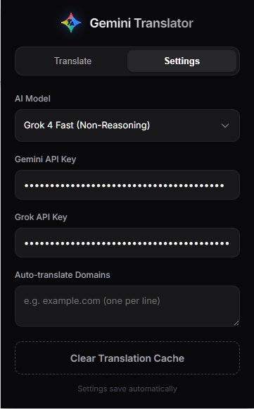

<p align="center">
  
</p>

<h1 align="center">Gemini Page Translator Pro</h1>

<p align="center">
  <a href="https://github.com/medy17/GeminiTranslate/blob/main/LICENSE">
    
  </a>
  <a href="https://developer.chrome.com/docs/extensions/mv3/">
    
  </a>
   <a href="https://chromewebstore.google.com/">
    
  </a>
</p>

<p align="center">
  <strong>A comprehensive Chrome extension that uses high-performance AI models from Google and xAI to deliver context-aware web page translations.</strong>
</p>

---

## Table of Contents

- [About The Project](#-about-the-project)
    - [Key Features](#-key-features)
- [ Tech Stack](#️-tech-stack)
- [ Architecture](#-architecture)
- [ Getting Started](#-getting-started)
    - [Prerequisites](#prerequisites)
    - [Installation](#installation)
- [ Usage](#-usage)
- [ Roadmap](#️-roadmap)
- [ License](#-license)
- [ Contact](#-contact)

---

##  About The Project

**Gemini Page Translator Pro** is a modern Chrome extension built with Manifest V3 that harnesses the power of leading AI models from Google (Gemini) and xAI (Grok) to provide high-quality, context-aware translations of web pages.


###  Key Features

*   **Multi-Provider AI Support:**
    *   **Google Gemini:** Supports Gemini 2.5 Pro, Flash, and the Gemma 3 family for high-fidelity translation.
    *   **xAI Grok:** Supports Grok 4 and Grok 4 Fast for rapid translations and/or NSFW content translation.
*   **Immersive UI:**
    *   A dark-themed popup with custom dropdowns and fluid interactions.
*   **Flexible Translation Modes:**
    *   **Full Page:** Translates visible text nodes across the entire DOM.
    *   **Context Selection:** Highlight specific text, right-click, and translate within the page.
*   **Smart Context Management:**
    *   Utilises JSON-structured prompts to ensure the AI returns translation data that maps perfectly to the original text segments.
    *   **Non-Destructive:** Translations are injected as overlay spans. Clicking a translated sentence instantly toggles it back to the original text.
*   **Efficiency & Caching:**
    *   Uses a session-based caching system to prevent redundant API calls for previously translated phrases.
    *   Batches requests to avoid API rate limits while maximising throughput.
*   **Automation:**
    *   Define a list of domains to automatically trigger translation upon visiting.

---

###  Screenshots

|                  Main Interface                   |                    Settings Page                    |
|:-------------------------------------------------:|:---------------------------------------------------:|
|  |  |
---
+
##  Tech Stack

*   **Core:** HTML5, CSS3 (Variables, Keyframe Animations), Vanilla JavaScript (ES6+).
*   **Platform:** Chrome Extension API (Manifest V3).
*   **Styling:** Custom CSS.
*   **AI Integration:** RESTful integration with Google Generative Language API and xAI API.

---

##  Architecture

The project is built with the **Manifest V3** standard.

1.  **Service Worker:** Handles the heavy lifting of API communication. It manages the request queue, enforces concurrency limits, and maintains the translation cache.
2.  **Content Script:** Uses a `TreeWalker` to efficiently traverse the DOM, identifying translateable text nodes while ignoring code, scripts, and hidden elements. It injects translations non-destructively, preserving the original page structure and event listeners.

---

##  Getting Started

### Prerequisites

*   A Chromium-based web browser (Chrome, Edge, Brave, Arc).
*   An API key:
    *   **Google AI Studio (or Vertex) Key** (for Gemini models).
    *   **xAI API Key** (for Grok models).
   _*   **Claude** (Coming soon)_

### Installation

1.  Clone the repository or download the ZIP file.
    ```bash
    git clone https://github.com/medy17/GeminiTranslate.git
    ```
2.  Open your browser and navigate to the extensions management page (`chrome://extensions`).
3.  Enable **"Developer mode"** (usually a toggle in the top-right).
4.  Click **"Load unpacked"**.
5.  Select the directory containing the `manifest.json` file.
6.  If you get an error regarding the `__tests__` folder, run `npm run build` then load the resulting `dist` folder instead. 

---

##  Usage

1.  **Configuration:**
    *   Click the extension icon in your toolbar.
    *   Navigate to the **Settings** tab.
    *   Enter your API Key(s) and select your preferred AI Model.
    *   (Optional) Add domains to the "Auto-translate" list. (Be careful with this since some websites may contain a huge number of DOM nodes and will eat up your quota).
2.  **Translating a Page:**
    *   Open the popup on any webpage.
    *   Select your **Source** and **Target** languages (or leave Source as "Auto-detect").
    *   Click the **"Translate Page"** button. The button will animate, and an overlay will appear showing progress.
3.  **Translating Selection:**
    *   Highlight text on a webpage.
    *   Right-click and select **"Translate Selection"** from the context menu.
4.  **Interacting:**
    *   Hover over translated text to see a highlight effect.
    *   Click any translated sentence to revert it to the original language.

---

##  Roadmap

- [x] Full Page Translation with Batching
- [x] Context Menu Integration
- [x] Dual AI Provider Support (Google & xAI)
- [x] Custom UI with Dark Mode & Animations
- [ ] Advanced filtering (exclude strictly technical code blocks or formulas).
- [ ] Anthropic model support (probably Haiku).

##  License

Distributed under the MIT License. See `LICENSE` for more information.

---

##  Contact

Ahmed Arat - [aratahmed@gmail.com](mailto:aratahmed@gmail.com)

Project Link: [https://github.com/medy17/GeminiTranslate](https://github.com/medy17/GeminiTranslate)
